# HappyHouse

-green.svg)

 

## 🎈 Overview
프로젝트로 개발한 부동산 투자를 앞둔 유저들에게 도움을 줄 수 있는 사이트입니다.

### 📎 이미지 크롤러 - [추후 링크 추가 예정](https://jaehyunup.github.io)  
### 📎 채팅 웹소켓 서버 - [추후 링크 추가 예정](https://jaehyunup.github.io)

   

## 🎡 개발환경
- 기본 환경
    - IDE : IntelliJ
    - OS : Windows
    - Git
- 웹서비스 개발환경
    - Vue.js
    - Javascript
    - npm
    - Vue-cli
    - Java 1.8 (openjdk)
    - Spring Boot 2.3.5
    - Maven
    - JUnit5
- Dependency
    - kakaomap-api
    - 공공데이터포털 데이터
    - mybatis
    - jjwt

   

## 📸 Screen Shots    

   

### 메인   
  
처음이용하는 유저도 자연스럽게 모든 기능에 접근할 수 있게끔 낮은 Layer를 가진 UI를 구현하려고 노력하였습니다.    

   

### 🎞 유저관리 (회원가입 및 로그인 등)
     
사용자는 회원가입 과정에서 별도의 버튼없이 자연스럽게 닉네임 ,아이디 중복체크가 가능하게 됩니다.    

   

### 🎞 유저 닉네임 변경
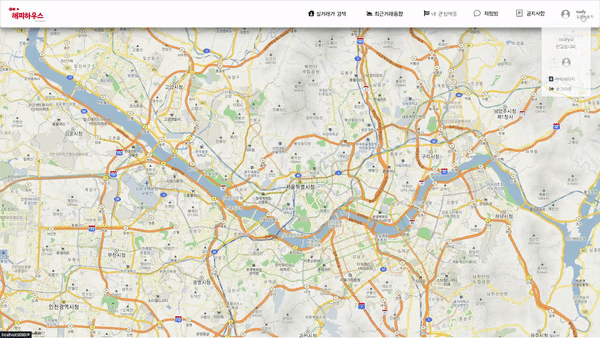    
사용자는 닉네임을 변경할 수 있으며, 이과정에서 자연스러운 중복체크 과정을 거치게 됩니다.    

   

### 🎞 아파트 실거래가 검색  
   
법정동명을 입력해서 해당 법정동의 아파트 실거래가 내역을 볼 수 있습니다.      

   

### 🎞 아파트 상세정보 보기        
  
아파트 목록을 클릭하면 해당 아파트의 상세정보를 알 수 있으며, 
이 과정에서 실시간으로 별도의 이미지크롤링 서버를 도입하여 
동적으로 아파트 이미지를 제공하며,아파트 평수별 가격 변동, 아파트정보,주변 안심병원&보건소 등 관련정보를 얻을 수 있습니다.    

   

### 🎞 관심매물 관리  
  
관심있는 아파트의 거래내역을 관심매물로 등록하여 주시할 수 있으며, 관리할 수 있습니다.  
   

### 🎞 지역구 분석기능  
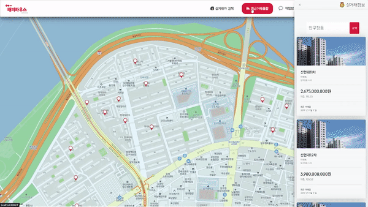  
선택한 지역구내 아파트 거래량 변동, 나이&성별 별 활동인구 분석 등 여러가지 데이터를 시각화하여
해당 지역구 데이터를 시각화하였습니다.  
   

### 🎞 익명 채팅방
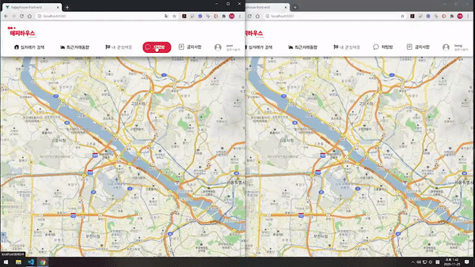  
접속한 모든 사용자가 공유하는 익명채팅방입니다. 별도의 Nodejs 기반 웹소켓을 사용하여 만들어졌습니다  

   

### 🎞 공지사항
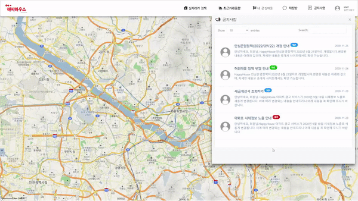  
유저는 공지사항을 볼 수있습니다. 공지사항 등록은 관리자 권한으로 접근가능한 별도의 관리자 페이지에서 가능합니다.  

 

## ⛏ 개발환경  

- 기본 환경
  - IDE : IntelliJ
  - OS : Windows
  - Git
- 

##  ⛸ 요구사항 명세서

| 순번 | 요구사항명                   | 상세                                                         |      |
| ---- | ---------------------------- | ------------------------------------------------------------ | ---- |
| F01  | 아파트 실거래가 정보 수집    | 국토교통부 아파트 실거래가정보 활용,데이터 가공 후 DB 저장하여 사용자에게 제공 |      |
| F02  | 주택 실거래가 정보 수집      | 상동                                                         |      |
| F03  | 아파트/주택 거래내역 조회    | 아파트 및 주택 거래내역 정보 제공                            |      |
| F04  | 특정기준 거래내역 검색       | 각 법정동 기준 거래내역 검색                                 |      |
| F05  | 거래내역 상세 조회           | 리스트에서 클릭한 거래내역에 대한 상세 조회                  |      |
| F06  | 회원 관리                    | 회원가입,수정 등 회원정보에 대한 관리 기능                   |      |
| F07  | 로그인&로그아웃              | jwt기반 인증 로그인 기능                                     |      |
| F08  | 닉네임 변경                  | 유저의 닉네임 변경 기능                                      |      |
| F09  | 관심 매물 기능               | 검색된 실거래가 매물을 관심매물로 등록하여 관리할 수 있음    |      |
| F10  | 공지사항 등록,수정           | 관리자는 관리자페이지를 통해 공지사항(추가,수정,삭제등) 관리 |      |
| F11  | 공지사항 조회                | 일반 사용자는 공지사항을 볼 수 있음                          |      |
| F12  | 실시간 아파트 이미지정보     | 이미지 크롤링서버를 통해 수집된 이미지를 실시간으로 제공함   |      |
| F13  | 해당 아파트 평수 제공        | 아파트 클릭시 해당 아파트에 존재하는 평수 목록을 제공        |      |
| F14  | 아파트 평수 별 실거래가 차트 | 선택한 아파트 평수 별 실거래가 차트를 제공                   |      |
| F15  | 아파트 주변 보건소 제공      | 선택한 아파트 주변 안심보건소 정보를 제공                    |      |
| F16  | 아파트 주변 안심진료소 제공  | 선택한 아파트 주변 안심진료소 제공                           |      |
| F17  | 지역 활동량 데이터 제공      | 해당 지역의 나이/성별 별 활동량 데이터 제공                  |      |
| F18  | 아파트 거래량 차트           | 해당 지역 아파트 거래량 변동 차트를 제공                     |      |
| F19  | TOP20 아파트 조회            | 해당 지역 가장 비싼 20개 아파트 정보를 제공                  |      |
| F20  | 채팅방                       | 모든 사용자와 대화할 수 있는 채팅방                          |      |

## 📠 클래스 다이어그램

### 1. 유저 로그인 기능

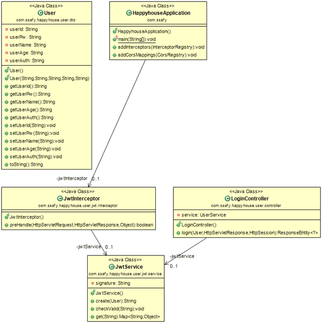

### 2. 공지사항 기능

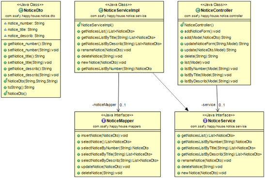

### 3. 아파트 거래 관련 기능

    

### 4. 관심지역, 관심매물 기능

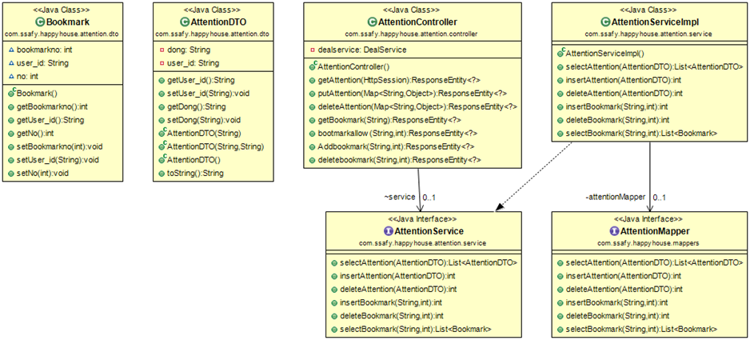

### 5. 안심병원 기능

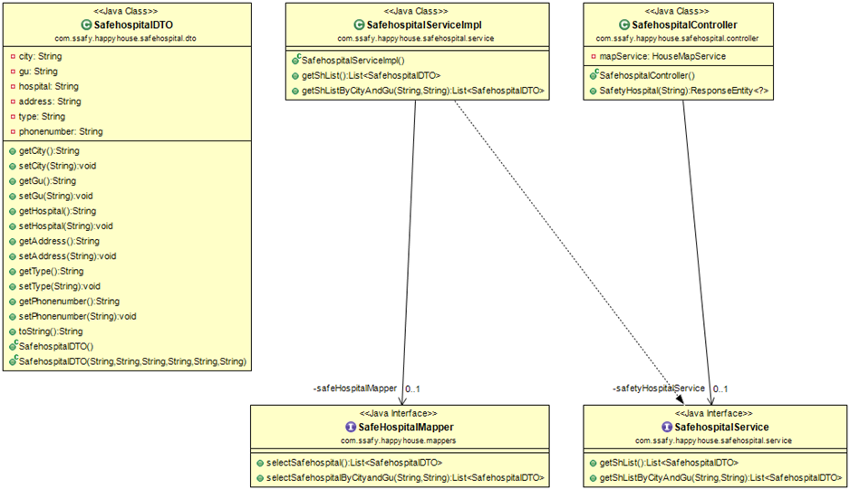

### 6. 주변 보건소 기능

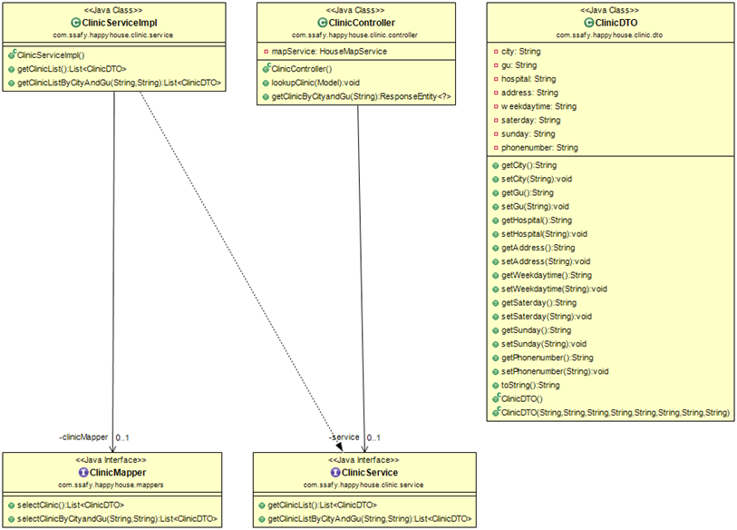

### 7. 지도,위치 관련 기능

법정동,시도군구 코드가 제공되는 공공데이터별로 달라 이에 대응하기위해 기능 별로 올바른 시도군구코드를 반환할 수 있게 별도의 클래스로 구성되어있습니다.

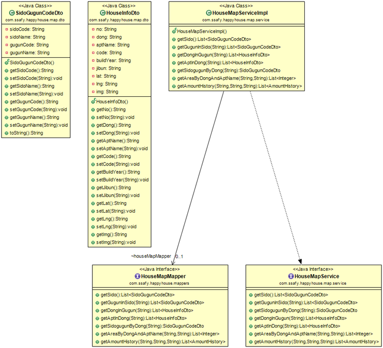

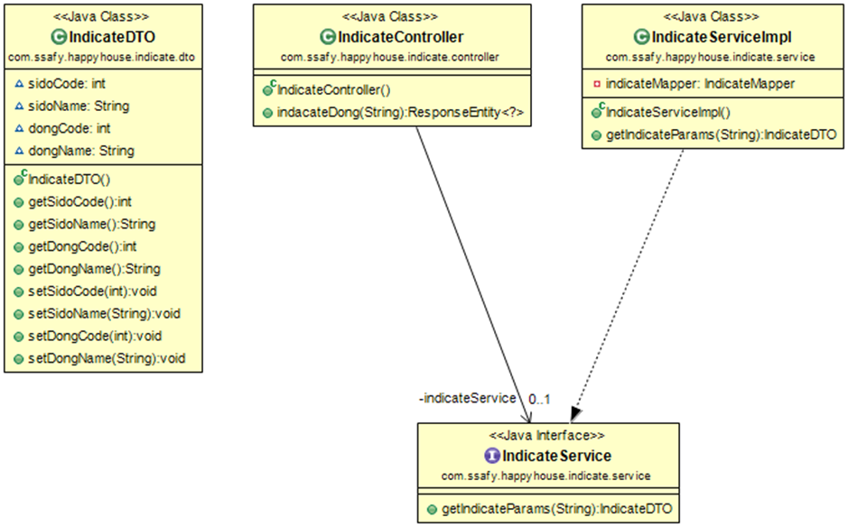

### 8 . 회원 관리 기능

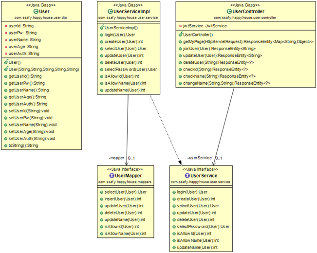
