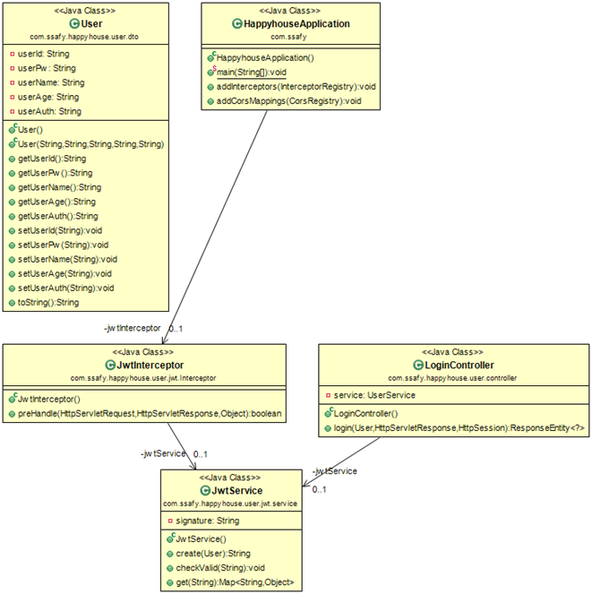
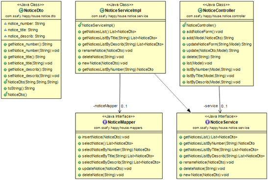
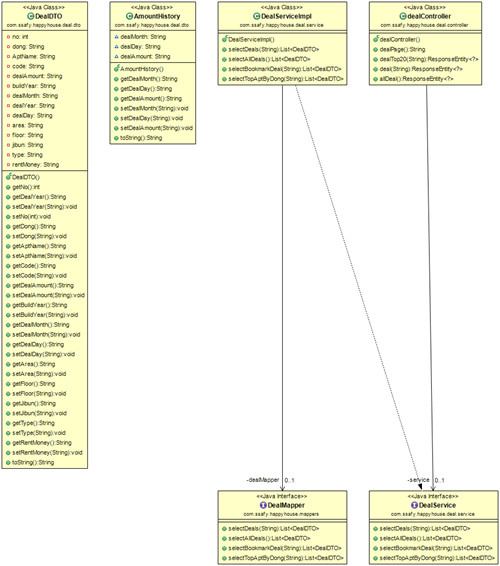
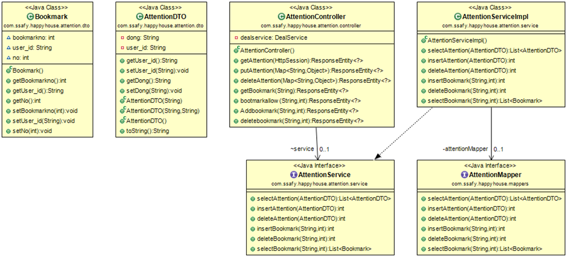
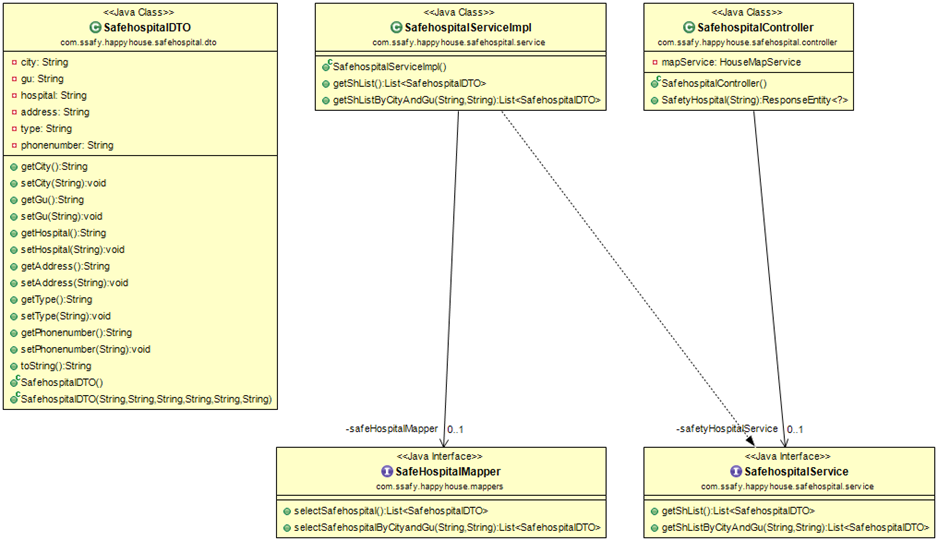
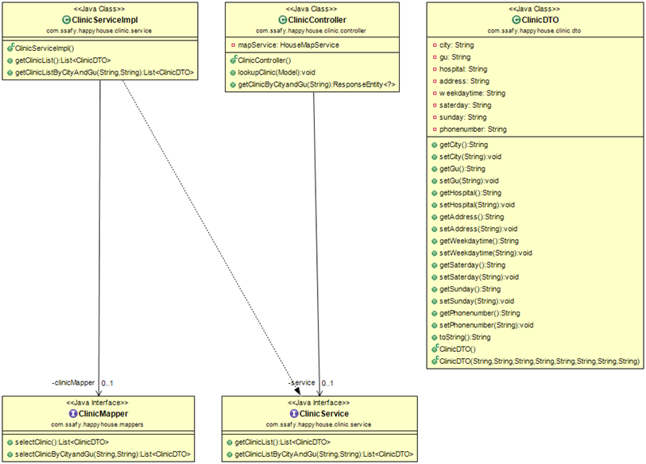
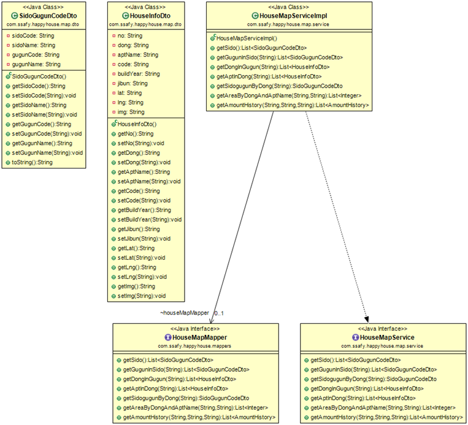
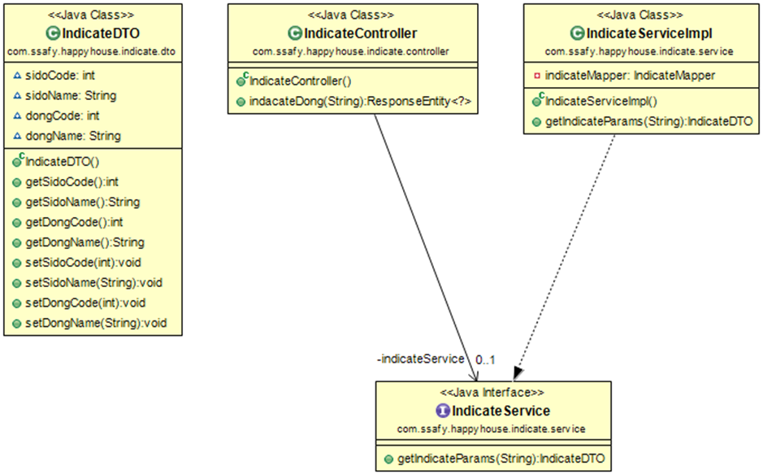
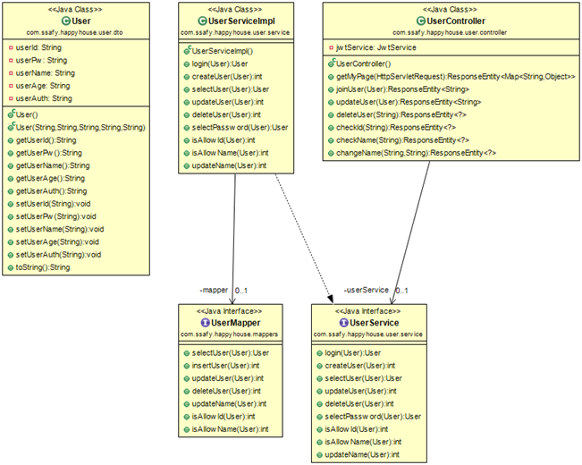

# [real-estate-helper](https://github.com/jaehyunup/realestate-helper-backendServer)  

-green.svg)  

## 🎈 Overview!!
프로젝트로 개발한 부동산 투자를 앞둔 유저들에게 도움을 줄 수 있는 사이트 [realestate-helper](https://github.com/jaehyunup/realestate-helper) 의 백앤드 서버입니다.  
  
### 📎 백앤드 - [realestate-helper-backendServer](https://github.com/jaehyunup/realestate-helper-backendServer)
### 📎 프론트앤드 - [realestate-helper-frontendServer](https://github.com/jaehyunup/realestate-helper-frontendServer)
### 📎 이미지 크롤러 - [추후 링크 추가 예정](https://jaehyunup.github.io)
### 📎 채팅 웹소켓 서버 - [추후 링크 추가 예정](https://jaehyunup.github.io)

## ⛏ 개발환경  
- 기본 환경
    - IDE : IntelliJ
    - OS : Windows
    - Git
- 웹서비스 개발환경
    - Java 1.8 (openjdk)
    - Spring Boot 2.3.5
    - Maven
    - JUnit5
- Dependency
    - mybatis
    - jjwt
    

##  ⛸ 요구사항 명세서
순번|요구사항명|상세|
---|---|---
F01|아파트 실거래가 정보 수집|국토교통부 아파트 실거래가정보 활용,데이터 가공 후 DB 저장하여 사용자에게 제공
F02|주택 실거래가 정보 수집|상동
F03|아파트/주택 거래내역 조회| 아파트 및 주택 거래내역 정보 제공
F04|특정기준 거래내역 검색|각 법정동 기준 거래내역 검색
F05|거래내역 상세 조회|리스트에서 클릭한 거래내역에 대한 상세 조회
F06|회원 관리| 회원가입,수정 등 회원정보에 대한 관리 기능
F07|로그인&로그아웃| jwt기반 인증 로그인 기능 
F08|닉네임 변경|유저의 닉네임 변경 기능
F09|관심 매물 기능|검색된 실거래가 매물을 관심매물로 등록하여 관리할 수 있음
F10|공지사항 등록,수정| 관리자는 관리자페이지를 통해 공지사항(추가,수정,삭제등) 관리
F11|공지사항 조회|일반 사용자는 공지사항을 볼 수 있음
F12|실시간 아파트 이미지정보|이미지 크롤링서버를 통해 수집된 이미지를 실시간으로 제공함
F13|해당 아파트 평수 제공|아파트 클릭시 해당 아파트에 존재하는 평수 목록을 제공
F14|아파트 평수 별 실거래가 차트 |선택한 아파트 평수 별 실거래가 차트를 제공
F15|아파트 주변 보건소 제공|선택한 아파트 주변 안심보건소 정보를 제공
F16|아파트 주변 안심진료소 제공|선택한 아파트 주변 안심진료소 제공
F17|지역 활동량 데이터 제공|해당 지역의 나이/성별 별 활동량 데이터 제공
F18|아파트 거래량 차트|해당 지역 아파트 거래량 변동 차트를 제공
F19|TOP20 아파트 조회	|해당 지역 가장 비싼 20개 아파트 정보를 제공
F20|채팅방|모든 사용자와 대화할 수 있는 채팅방

## 📠 클래스 다이어그램

### 1. 유저 로그인 기능

### 2. 공지사항 기능

### 3. 아파트 거래 관련 기능

    
### 4. 관심지역, 관심매물 기능

### 5. 안심병원 기능

### 6. 주변 보건소 기능

### 7. 지도,위치 관련 기능
법정동,시도군구 코드가 제공되는 공공데이터별로 달라 이에 대응하기위해 기능 별로 올바른 시도군구코드를 반환할 수 있게 별도의 클래스로 구성되어있습니다.

### 8 . 회원 관리 기능

